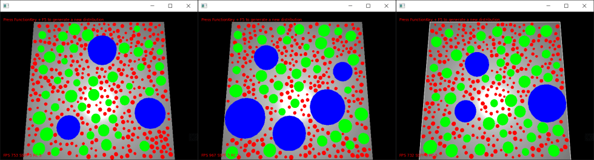
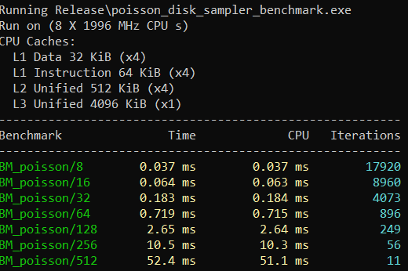

# Object placement using poisson disk sampling

Inspired by [Herman Tulleken's article](http://devmag.org.za/2009/05/03/poisson-disk-sampling/) and extended to distribute points with no overlap across layers containing objects of varying radii and separated by varying min / max distances.

# How to use

To use in your project simply add poisson.h and poisson.cpp to your project and then define your layers ([see the example in main.cpp](main.cpp)).

To build the demo:

```
git clone https://github.com/bensanmorris/poisson_disk_sampler
cd poisson_disk_sampler
cmake -B build -G "Visual Studio 15 2017" -A x64 .
cd build
cmake --build . --config Release
Release\poisson_disk_sampler_benchmark.exe
```

The output is an array (an std::vector<PointList>) of layers where each layer contains an array (an std::vector<Circle>) of circles:

```
PoissonDiskMultiSampler sampler(/*refer to main.cpp*/);
PoissonDiskMultiSampler::PointListArray layers;
sampler.sample(layers);
for(const auto& layer : layers)
{
    for(const auto& circle : layer)
    {
        // the circle represent's the bounds of an object in the current layer
    }
}
```



# Performance

Here are some performance statistics for tile sizes 8,16,32,64,128,256,512 for a distribution containing 3 layers. NB. The culling of overlapping objects accross layers uses a brute force approach and so could be improved upon (see ```checkPoint()```):


