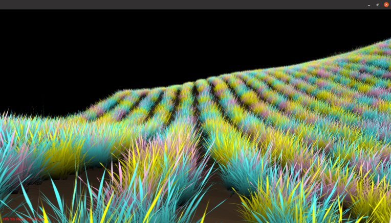

# Poisson disk sampling

Poisson disk sampling can be used to procedurally sample a region of space. It's not as messy as random placement or as uniform as grid-based methods. This solution is inspired by [Herman Tulleken's article](http://devmag.org.za/2009/05/03/poisson-disk-sampling/) which I've extended to support sampling regions using varying sampling radii and sample separation distances (using layers - a layer defines a sample's min / max radius and separation distance). The approach uses brute force so could be optimised (see further work section below)

Some applications:

- Sampling an image / regions of an image
- Procedurally placing objects of varying sizes in a game with no overlap

# How to use

To use in your project simply add poisson.h and poisson.cpp to your project and then define your layers ([see the example in main.cpp](main.cpp)).

To build the demo:

```
git clone https://github.com/bensanmorris/poisson_disk_sampler
cd poisson_disk_sampler
cmake -B build -G "Visual Studio 15 2017" -A x64 .
cd build
cmake --build . --config Release
Release\poisson_disk_sampler_benchmark.exe
```

The output is an array (an std::vector<PointList>) of layers where each layer contains an array (an std::vector<Circle>) of circles:

```
PoissonDiskMultiSampler sampler(/*refer to main.cpp*/);
PoissonDiskMultiSampler::PointListArray layers;
sampler.sample(layers);
for(const auto& layer : layers)
{
    for(const auto& circle : layer)
    {
        // the circle represent's the bounds of an object in the current layer
    }
}
```


# Filtering 

Discard points by implementing the `placeObject` method to perform your filtering (i.e. discard points in scene meshes or using simle formulae):

```
struct Distribution : public PoissonDiskMultiSampler::RealFunction2D
{
Distribution(){}
virtual bool placeObject(int layerIndex, float x, float y) {
    return int(x) % 2 == 0;
}
};
Distribution distribution;
PoissonDiskMultiSampler sampler(-(SIZE / 2.f),
                            -(SIZE / 2.f),
                             (SIZE / 2.f),
                             (SIZE / 2.f),
                             minDist,
                             minRadi,
                             maxRadi,
                             200*SIZE,
                             distribution,
                             minDist.size() > 1,
                             30);
```

The above will discard items placed on uneven columns to create a furrowed field effect for instance:



# Performance and further work

Here are some performance statistics for tile sizes 8,16,32,64,128,256,512 for a distribution containing 3 layers. NB. The culling of overlapping objects accross layers uses a brute force approach and so could be improved upon (see ```checkPoint()```):


    
# Tip Jar / Patreon

If you find this project useful and want to buy me a coffee then you can do so via my itch.io page by [downloading my free software and making a donation as part of that process here](https://benmorris.itch.io/plugin-based-scene-editor). Alternatively if you want to keep this code monkey in bananas then you can [support me over on Patreon, thanks!](https://www.patreon.com/SimulationStarterKit)
